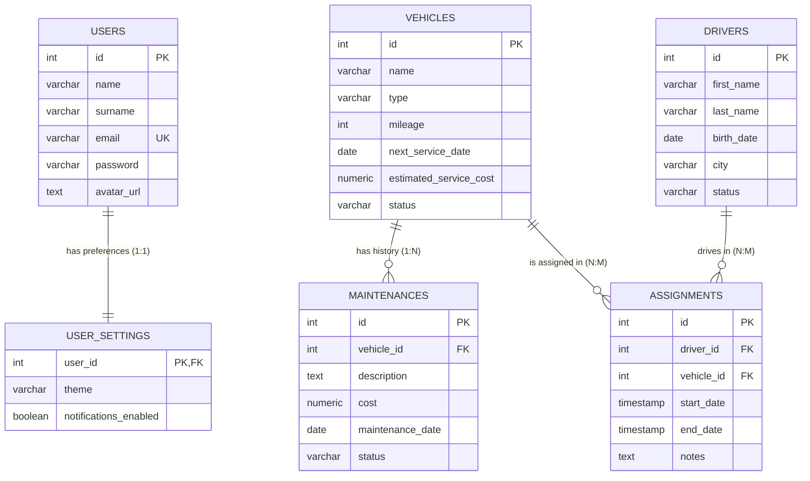

# Entity Relationship Diagram (ERD)

Based on the updated database schema (`docker/db/init.sql`), the application now implements a full relational model with advanced features.

## Advanced Database Features Implemented

### 1. Relationships
*   **1:1 (One-to-One)**: `USERS` <-> `USER_SETTINGS`. Each user has exactly one settings record.
*   **1:N (One-to-Many)**: `VEHICLES` <-> `MAINTENANCES`. One vehicle has multiple maintenance records.
*   **N:M (Many-to-Many)**: `DRIVERS` <-> `VEHICLES` through `ASSIGNMENTS`. To allow tracking history of who drove which vehicle when.

### 2. Views
*   `v_fleet_summary`: Joins Vehicles and Assignments to show usage stats.
*   `v_maintenance_costs`: Joins Vehicles and Maintenance to show total costs.

### 3. Triggers & Functions
*   **Trigger**: `trg_update_status_on_assignment`. Automatically updates `VEHICLES.status` and `DRIVERS.status` to `'w trasie'` when a new assignment is created, and back to `'wolny'` when it ends.
*   **Function**: `calculate_total_maintenance_cost(vehicle_id)`. Returns sum of costs.

### 4. Integrity
*   **Foreign Keys**: Implemented with `ON DELETE CASCADE` to prevent orphan records.
*   **Transactions**: Handled at the application level (Repository) or implicitly via atomic SQL operations within functions.
