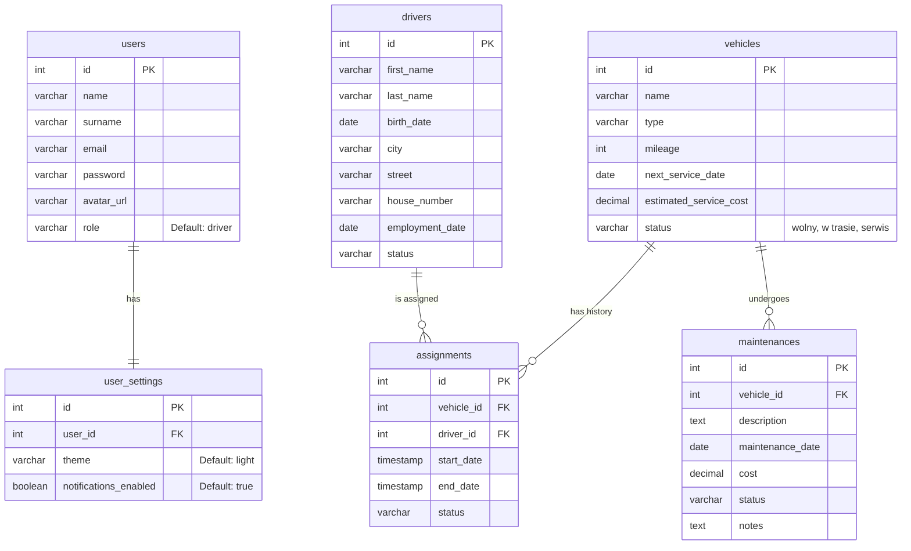

```mermaid
erDiagram
    users {
        int id PK
        varchar name
        varchar surname
        varchar email
        varchar password
        varchar avatar_url
        varchar role "Default: driver"
    }

    user_settings {
        int id PK
        int user_id FK
        varchar theme "Default: light"
        boolean notifications_enabled "Default: true"
    }

    vehicles {
        int id PK
        varchar name
        varchar type
        int mileage
        date next_service_date
        decimal estimated_service_cost
        varchar status "wolny, w trasie, serwis"
    }

    drivers {
        int id PK
        varchar first_name
        varchar last_name
        date birth_date
        varchar city
        varchar street
        varchar house_number
        date employment_date
        varchar status
    }

    assignments {
        int id PK
        int vehicle_id FK
        int driver_id FK
        timestamp start_date
        timestamp end_date
        varchar status
    }

    maintenances {
        int id PK
        int vehicle_id FK
        text description
        date maintenance_date
        decimal cost
        varchar status
        text notes
    }

    users ||--|| user_settings : "has"
    vehicles ||--o{ assignments : "has history"
    drivers ||--o{ assignments : "is assigned"
    vehicles ||--o{ maintenances : "undergoes"
```
