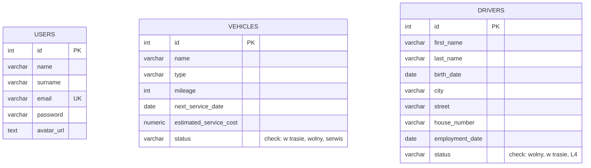

# Entity Relationship Diagram (ERD)

Based on the current database schema (`docker/db/init.sql`) and application logic (`src/repository`), the application consists of three independent entities.

## Description
*   **USERS**: Stores administrator accounts for logging into the Fleet Manager.
*   **VEHICLES**: Stores the fleet inventory with mileage, service data, and status.
*   **DRIVERS**: Stores employee information including personal details and status.

**Note**: Currently, there are no relational links (Foreign Keys) between these tables enforced in the database.
