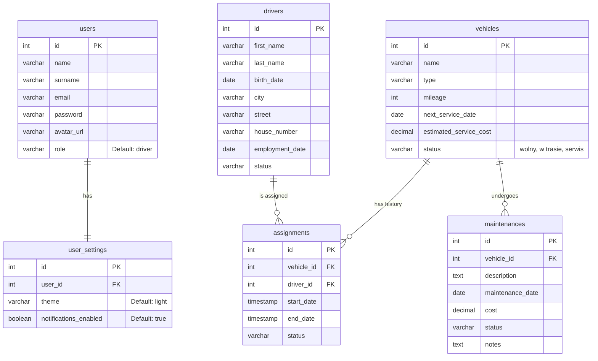

# 🚛 Fleet Manager - System Zarządzania Flotą i Logistyką

> **Profesjonalne narzędzie webowe do kompleksowej obsługi floty pojazdów, ewidencji kierowców oraz analizy kosztów operacyjnych.**

---

## O Projekcie

**Fleet Manager** to zaawansowana aplikacja internetowa stworzona w celu cyfryzacji procesów zarządzania flotą w przedsiębiorstwach transportowych. System rozwiązuje kluczowe problemy logistyczne, takie jak:
- Brak centralnej ewidencji pojazdów i kierowców.
- Trudności w monitorowaniu terminów przeglądów i ubezpieczeń.
- Brak kontroli nad kosztami eksploatacyjnymi floty.
- Rozproszenie danych (arkusze Excel, papierowa dokumentacja).

Aplikacja została zaprojektowana z naciskiem na **bezpieczeństwo**, **skalowalność** oraz **wydajność**, wykorzystując nowoczesne standardy programowania (MVC, Docker, PostgreSQL).

---

## Technologie

Projekt wykorzystuje nowoczesny stos technologiczny zapewniający stabilność i łatwość wdrażania:

| Kategoria | Technologia | Opis |
|-----------|-------------|------|
| **Backend** | **PHP 8.2** | Czysty PHP w architekturze MVC (bez frameworków zewnętrznych). |
| **Baza Danych** | **PostgreSQL** | Relacyjna baza danych zapewniająca integralność danych. |
| **Frontend** | **HTML5, CSS3, JS** | Responsywny interfejs (RWD), wykresy Chart.js. |
| **Serwer WWW** | **Nginx** | Wydajny serwer HTTP obsługujący żądania. |
| **Konteneryzacja** | **Docker & Compose** | Pełna izolacja środowiska i łatwy deployment. |
| **Testy** | **PHPUnit** | Automatyczne testy jednostkowe i integracyjne. |

---

## Funkcjonalności

### 1. Panel Administratora (Dashboard)
- Szybki podgląd stanu floty (dostępne/zajęte pojazdy).
- Statystyki kosztów serwisowych.
- Powiadomienia o zbliżających się przeglądach.

### 2. Zarządzanie Rolami (RBAC)
- **Admin**: Pełny dostęp do wszystkich funkcjonalności (edycja, dodawanie, usuwanie).
- **Kierowca (Driver)**: Ograniczony dostęp (podgląd listy pojazdów, zmiana statusu, zgłaszanie usterek).

### 3. Ewidencja Pojazdów
- Pełna kartoteka pojazdu (marka, model, przebieg, status).
- Historia serwisowa i koszty napraw.
- Śledzenie terminów badań technicznych.

### 4. Baza Kierowców
- Dane personalne i historia zatrudnienia.
- Status dostępności kierowcy.

### 5. Moduł Finansowy i Raporty
- Wykresy kosztów utrzymania floty.
- Symulator prognozowania wydatków.

### 6. Bezpieczeństwo
- Ochrona przed atakami **SQL Injection** (Prepared Statements).
- Ochrona przed **XSS** (Sanityzacja danych wyjściowych).
- Bezpieczne sesje (**HttpOnly**, **SameSite**).
- Własny system routingu z obsługą błędów 400/403/404/500.

---

## Struktura Bazy Danych (ERD)

Baza danych została zaprojektowana w 3. postaci normalnej (3NF) dla zapewnienia integralności.



---

## Instalacja i Uruchomienie

Projekt jest w pełni skonteneryzowany. Wymagany jest tylko zainstalowany **Docker Desktop**.

### Krok 1: Klonowanie
```bash
git clone https://github.com/twoj-login/fleet-manager.git
cd fleet-manager
```

### Krok 2: Uruchomienie kontenerów
```bash
docker-compose up -d --build
```
*Komenda ta zbuduje obrazy Nginx, PHP i Bazy Danych oraz utworzy sieć wirtualną.*

### Krok 3: Dostęp
Aplikacja dostępna jest pod adresem: **http://localhost:8080**

Po uruchomieniu aplikacja automatycznie wykona migrację struktury bazy danych (w tym dodanie ról użytkowników).

---

## Testy

Projekt posiada zaimplementowane testy automatyczne wykorzystujące **PHPUnit**.
Zakres testów obejmuje:
- **Testy Jednostkowe**: Weryfikacja logiki biznesowej (np. Singleton w `UserRepository`).
- **Testy Integracyjne**: Sprawdzenie dostępności endpointów i statusów HTTP (200, 404).

### Uruchamianie Testów

Aby uruchomić testy, wykonaj poniższą komendę w terminalu (będąc w katalogu głównym projektu):

```bash
docker exec -i webintro-php-1 php /app/vendor/bin/phpunit /app/tests
```

Komenda ta uruchamia PHPUnit wewnątrz kontenera PHP, wykonując wszystkie testy zdefiniowane w katalogu `tests/`.

---

## Autor
Autor: pSus365
Projekt wykonany w ramach zaliczenia przedmiotu Projektowanie Aplikacji Internetowych.

Wszelkie prawa zastrzeżone.

---

## Realizacja Projektu

Poniżej znajduje się lista zrealizowanych funkcjonalności oraz wymagań projektowych:

### Architektura i Technologie
- [x] **Architektura Aplikacji**: Wzorzec MVC (Model-View-Controller) z podziałem na Frontend i Backend.
- [x] **Kod Obiektowy**: Backend napisany w pełni obiektowo (Klasy, Dziedziczenie, Interfejsy).
- [x] **Baza Danych**: PostgreSQL - relacyjna baza danych.
- [x] **Diagram ERD**: Struktura bazy danych została zaprojektowana i udokumentowana.
- [x] **GIT**: Wykorzystanie systemu kontroli wersji.
- [x] **Eksport Bazy**: Dostępny plik zrzutu bazy danych (`.sql`).
- [x] **Technologie Webowe**: HTML, CSS (Design), PHP, JavaScript.

### Funkcjonalności
- [x] **Logowanie i Sesje**: Bezpieczny system uwierzytelniania użytkowników.
- [x] **Uprawnienia i Role**:
    - Obsługa co najmniej dwóch ról: **Administrator** i **Kierowca**.
    - Ograniczony dostęp do zasobów w zależności od roli.
- [x] **Bezpieczeństwo**:
    - Ochrona przed SQL Injection (Prepared Statements).
    - Walidacja danych wejściowych.
- [x] **Złożoność Bazy Danych**: Wykorzystanie widoków oraz relacji między tabelami.
- [x] **Responsywność (RWD)**: Aplikacja dostosowana do urządzeń mobilnych i desktopowych.
- [x] **Wylogowywanie**: Poprawne niszczenie sesji użytkownika.

### Dodatkowe Osiągnięcia
- [x] **Generowanie Raportów PDF**: Implementacja biblioteki `jsPDF` do tworzenia raportów dla pojazdów i kierowców.
- [x] **Wizualizacja Danych**: Integracja z `Chart.js` do generowania wykresów statystycznych w raportach.

---

## Scenariusze Testowe

Poniżej przedstawiono przykładowe scenariusze testowe weryfikujące poprawność działania kluczowych funkcjonalności:

### 1. Logowanie do Systemu
**Cel**: Weryfikacja poprawności procesu uwierzytelniania.
1. Wejdź na stronę główną.
2. Spróbuj przejść do `/dashboard` bez logowania -> Oczekiwane przekierowanie do `/login`.
3. Wprowadź niepoprawne dane -> Oczekiwany komunikat błędu.
4. Wprowadź poprawne dane administratora -> Przekierowanie do panelu głównego.

### 2. Zarządzanie Pojazdami (CRUD)
**Cel**: Weryfikacja możliwości edycji floty.
1. Zaloguj się jako Administrator.
2. Przejdź do zakładki "Pojazdy".
3. Wybierz opcję dodania nowego pojazdu.
4. Uzupełnij formularz i zapisz -> Pojazd powinien pojawić się na liście.
5. Zmień status pojazdu na "W serwisie" -> Status powinien zaktualizować się w bazie i na widoku.

### 3. Generowanie Raportu PDF
**Cel**: Sprawdzenie funkcji eksportu danych.
1. Przejdź do zakładki "Raporty".
2. Wybierz pojazd z listy i kliknij "Generuj PDF".
3. System powinien pobrać plik PDF zawierający:
    - Dane pojazdu.
    - Tabelę kosztów/przebiegu.
    - Wygenerowany wykres (Chart.js).

### 4. Weryfikacja Uprawnień
**Cel**: Sprawdzenie izolacji ról.
1. Zaloguj się jako Kierowca.
2. Spróbuj usunąć pojazd lub innego użytkownika.
3. System powinien zablokować akcję lub ukryć przyciski administracyjne.
