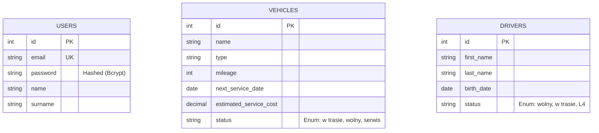

# 🚛 Fleet Manager - System Zarządzania Flotą i Logistyką

> **Profesjonalne narzędzie webowe do kompleksowej obsługi floty pojazdów, ewidencji kierowców oraz analizy kosztów operacyjnych.**

---

## 📖 O Projekcie

**Fleet Manager** to zaawansowana aplikacja internetowa stworzona w celu cyfryzacji procesów zarządzania flotą w przedsiębiorstwach transportowych. System rozwiązuje kluczowe problemy logistyczne, takie jak:
- Brak centralnej ewidencji pojazdów i kierowców.
- Trudności w monitorowaniu terminów przeglądów i ubezpieczeń.
- Brak kontroli nad kosztami eksploatacyjnymi floty.
- Rozproszenie danych (arkusze Excel, papierowa dokumentacja).

Aplikacja została zaprojektowana z naciskiem na **bezpieczeństwo**, **skalowalność** oraz **wydajność**, wykorzystując nowoczesne standardy programowania (MVC, Docker, PostgreSQL).

---

## 🛠 Technologie

Projekt wykorzystuje nowoczesny stos technologiczny zapewniający stabilność i łatwość wdrażania:

| Kategoria | Technologia | Opis |
|-----------|-------------|------|
| **Backend** | **PHP 8.2** | Czysty PHP w architekturze MVC (bez frameworków zewnętrznych). |
| **Baza Danych** | **PostgreSQL** | Relacyjna baza danych zapewniająca integralność danych. |
| **Frontend** | **HTML5, CSS3, JS** | Responsywny interfejs (RWD), wykresy Chart.js. |
| **Serwer WWW** | **Nginx** | Wydajny serwer HTTP obsługujący żądania. |
| **Konteneryzacja** | **Docker & Compose** | Pełna izolacja środowiska i łatwy deployment. |
| **Narzędzia** | **Git, pgAdmin** | Kontrola wersji i zarządzanie bazą danych. |

---

## 🏗 Architektura Systemu

System oparty jest na autorskim frameworku implementującym wzorzec **Model-View-Controller (MVC)**. Zastosowano wzorzec **Front Controller**, gdzie cały ruch kierowany jest do jednego punktu wejścia (`index.php`), który następnie dispatchuje żądania.

### Diagram Przepływu Danych

```mermaid
graph TD
    User((Użytkownik)) -->|Żądanie HTTP| Nginx[Serwer Nginx]
    Nginx -->|Przekazanie| Routing[Routing (index.php)]
    Routing -->|Wybór trasy| Controller[Kontroler]
    
    subgraph "Warstwa Aplikacji (PHP)"
    Controller -->|Pobierz dane| Repository[Repozytorium]
    Repository -->|SQL Query| Database[(PostgreSQL)]
    Database -->|Wynik| Repository
    Repository -->|Obiekt Modelu| Controller
    Controller -->|Dane + Szablon| View[Widok (HTML/PHP)]
    end
    
    View -->|Odpowiedź HTML| User
```

### Komponenty Architektury
1.  **Routing**: Centralny mechanizm mapowania adresów URL na akcje kontrolerów (np. `/vehicles` -> `VehicleController::index`).
2.  **Kontrolery (`src/controllers`)**: Odpowiadają za logikę biznesową, walidację danych wejściowych i sterowanie przepływem.
3.  **Repozytoria (`src/repository`)**: Warstwa abstrakcji bazy danych. Oddziela logikę SQL od logiki aplikacji, ułatwiając testowanie i zmiany bazy.
4.  **Widoki (`public/views`)**: Warstwa prezentacji, dynamicznie renderująca HTML na podstawie danych z kontrolera.

---

## 💾 Struktura Bazy Danych

Baza danych została zaprojektowana w 3. postaci normalnej (3NF) dla zapewnienia integralności.



---

## 🛡 Bezpieczeństwo (Security Features)

Aplikacja implementuje wielowarstwowe zabezpieczenia, czyniąc ją odporną na najczęstsze ataki webowe (zgodnie z OWASP Top 10).

### 1. Ochrona przed SQL Injection
**Problem**: Wstrzyknięcie złośliwego kodu SQL przez formularze.
**Rozwiązanie**: Wszystkie zapytania wykorzystują **Prepared Statements** (PDO). Dane są przesyłane oddzielnie od zapytania, co fizycznie uniemożliwia zmianę struktury SQL przez użytkownika.
```php
// Przykład z kodu (VehicleRepository.php)
$stmt = $this->database->connect()->prepare('INSERT INTO vehicles (...) VALUES (?, ?, ...)')
$stmt->execute([$name, $type, ...]); // Dane są bezpiecznie bindowane
```

### 2. Ochrona przed XSS (Cross-Site Scripting)
**Problem**: Wstrzyknięcie skryptów JS do przeglądarki ofiary.
**Rozwiązanie**: Automatyczna sanityzacja danych wyjściowych w `AppController`. Każda zmienna trafiająca do widoku jest przepuszczana przez `htmlspecialchars()`.

### 3. Pancerne Sesje (Session Hardening)
Sesje są skonfigurowane tak, aby zminimalizować ryzyko przejęcia (Session Hijacking):
- **HttpOnly**: Ciasteczko sesyjne jest niedostępne dla JavaScript (ochrona przed kradzieżą via XSS).
- **SameSite=Strict**: Ciasteczka nie są wysyłane przy linkach z innych stron (ochrona przed CSRF).
- **Secure**: Wymuszenie HTTPS (w środowisku produkcyjnym).

### 4. Bezpieczne Uwierzytelnianie
Hasła nigdy nie są przechowywane jawnym tekstem. System używa silnego algorytmu haszowania (Bcrypt/Argon2) przy rejestracji. Logowanie weryfikuje hash, a nie czysty tekst.

---

## 🚀 Instalacja i Uruchomienie

Projekt jest w pełni skonteneryzowany. Wymagany jest tylko zainstalowany **Docker Desktop**.

### Krok 1: Klonowanie
```bash
git clone https://github.com/twoj-login/fleet-manager.git
cd fleet-manager
```

### Krok 2: Uruchomienie kontenerów
```bash
docker-compose up -d --build
```
*Komenda ta zbuduje obrazy Nginx, PHP i Bazy Danych oraz utworzy sieć wirtualną.*

### Krok 3: Dostęp
Aplikacja dostępna jest pod adresem: **http://localhost:8080**

### Domyślne Dane Logowania
- **Email**: `admin@example.com`
- **Hasło**: `admin`

---

## 📝 Funkcjonalności dla Użytkownika

### 1. Dashboard Analityczny
Szybki podgląd stanu floty:
- Liczba dostępnych pojazdów vs. pojazdy w trasie.
- Alerty o zbliżających się przeglądach (poniżej 30 dni).
- Wykresy kosztów w czasie rzeczywistym.

### 2. Ewidencja Pojazdów
- Dodawanie nowych pojazdów ze specyfikacją (przebieg, typ, koszt serwisu).
- Edycja statusów (np. zmiana na "w trasie").
- Usuwanie pojazdów z floty.

### 3. Moduł Finansowy (Maintenance)
- `maintenance_stats.php`: Dedykowany widok z wykresami (Chart.js).
- Symulator kosztów: Kalkulator pozwalający przewidzieć koszty utrzymania floty w horyzoncie 6-12 miesięcy, uwzględniając inflację.

### 4. Panel Użytkownika
- Zarządzanie profilem.
- Zmiana hasła.
- Upload awatara (z walidacją typu pliku).

---

## 👨‍💻 Autor
Projekt wykonany w ramach zaliczenia przedmiotu [Nazwa Przedmiotu].
Wszelkie prawa zastrzeżone.
